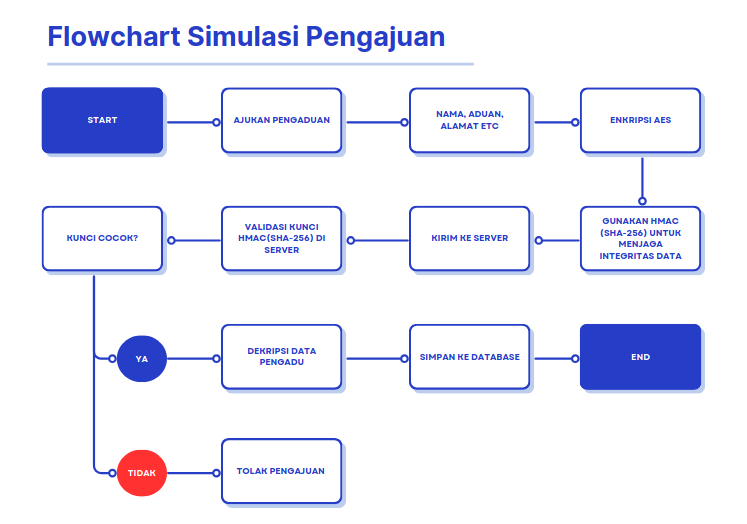
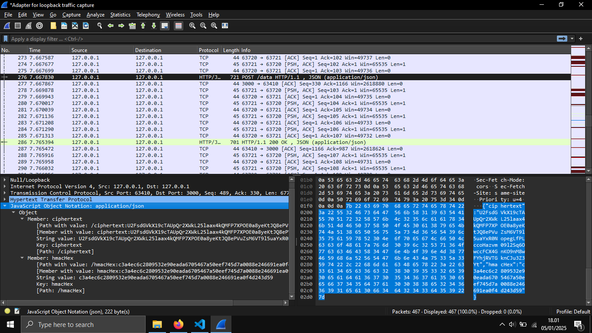

# Simulasi Sistem Pengaduan dengan Enkripsi AES & HMAC
Proyek ini adalah implementasi REST API sederhana menggunakan Express.js untuk menerima data terenkripsi dari client. Data dienkripsi menggunakan AES dan dilindungi dengan HMAC-SHA256 untuk menjamin integritas dan keaslian data.
Aplikasi ini saya dokumentasikan untuk mendukung pembelajaran saya dalam matakuliah Big Data Security di semester 4 yang berfokus pada **keamanan data**.

## Fitur
- **Enkripsi Data**: Semua data terenkripsi menggunakan AES sebelum dikirim ke server.
- **Validasi HMAC**: Memastikan integritas data dengan HMAC (SHA-256).
- **Simpan Data**: Data yang valid disimpan dalam file `database.json`.
- **Ambil Data**: Endpoint untuk menampilkan semua data yang sudah tersimpan dengan timestamp terformat.
- **CORS Support**: Server dapat menerima request dari client berbeda.

## Teknologi yang Digunakan
- Node.js
- Express
- CryptoJS
- js-crypto-hmac
- CORS
- File system (`fs`) untuk penyimpanan data

## Endpoint API

### 1. Kirim Data
**POST** `/data`  
Mengirim data terenkripsi ke server.

Request Body:
```json
{
  "hmacHex": "hmacHex",
  "ciphertext": "ciphertext"
}
```
Response sukses:
```json
{
"message": "Data berhasil diterima dan disimpan!",
  "data": {
    "nama": "andi",
    "no_telp": "083842323223",
    "email": "andi@sabroro.com",
    "address": "Jl. 63",
    "aduan": "Tetangga membuat rusuh ketika malam hari",
    "encrypted_data": "xxxx",
    "hmac": "xxxx",
    "timestamp": "2025-10-03T21:42:35.293Z"
  }
}
```
Response error jika HMAC salah:
```json
{
  "message": "HMAC tidak valid!"
}
```
### 2. Kirim Data
**GET** `/aduan`   

Mengambil semua data yang sudah disimpan.

Response:
```json
{
  "message": "Data berhasil diambil!",
  "data": [
    {
    "nama": "andi",
    "no_telp": "083842323223",
    "email": "andi@sabroro.com",
    "address": "Jl. 63",
    "aduan": "Tetangga membuat rusuh ketika malam hari",
    "encrypted_data": "xxxx",
    "hmac": "xxxx",
    "timestamp": "2025-10-03T21:42:35.293Z"
    }
  ]
}
```

# Installation 🚀

1. Clone repository ini:

   ```bash
   git clone https://github.com/mhbb8897/HMAC-with-SHA256.git
   ```

2. Install dependencies:

   ```bash
   npm install
   ```

3. Jalankan server
      ```bash
   npm run dev dan npm run server '(Buka di 2 tab berbeda)'
   ```

### 3. Flowchart dan Enkripsi Data

* **Flowchart**

  

* **Data pengadu yang di Enkripsi beserta HMAC Signature**

  

